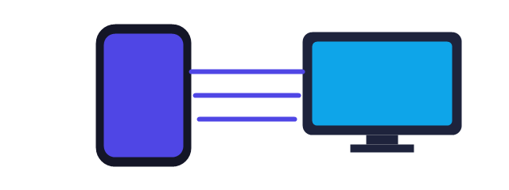

# MirrorLink

Wirelessly view and control your Android phone from your Windows PC over your
local Wi-Fi — screen mirroring, remote control, file transfer, and clipboard
sync. No accounts, no cloud, no paid servers. Everything runs peer-to-peer on
your own network.



## Highlights

- **Screen mirroring** — real-time, low-latency streaming with auto quality adjustment.
- **Remote control** — mouse, drag/swipe, scroll wheel, keyboard, back/home/recents,
  volume, and media keys.
- **File transfer** — drag & drop from PC to phone, and phone to PC.
- **Clipboard sync** — copy on one device, paste on the other.
- **Secure** — one-time pairing code + WebRTC DTLS-SRTP encryption. No tracking, no ads.
- **No servers** — discovery, signaling, and media all happen on your LAN.

## Repository layout

```
mirrorlink/
├── android-app/     Flutter Android app (phone side)
├── windows-app/     Flutter Windows desktop app (PC side)
├── website/         Marketing / download site (Cloudflare Pages + PWA)
├── .github/workflows/  CI: build APK/EXE, publish releases, deploy site
├── docs/            Protocol, architecture, install, build, security docs
└── README.md
```

## Getting started

| I am… | Read this |
| --- | --- |
| A user | [docs/INSTALLATION.md](docs/INSTALLATION.md) |
| Building from source | [docs/BUILD.md](docs/BUILD.md) |
| Learning how it works | [docs/ARCHITECTURE.md](docs/ARCHITECTURE.md) |
| Understanding pairing/streaming | [docs/PROTOCOL.md](docs/PROTOCOL.md) |
| Security model | [docs/SECURITY.md](docs/SECURITY.md) |

## Quick start

1. Install the **Windows app** and the **Android app**.
2. Connect both devices to the same Wi-Fi network.
3. On the PC, open MirrorLink → a 6-digit pairing code appears.
4. On the phone, tap **Pair device**, enter the code (or scan the QR), and go.

## How it works (30 seconds)

```
┌────────────────────────┐   discovery (UDP broadcast)   ┌────────────────────────┐
│  Android phone         │ ◄────────────────────────────► │  Windows PC            │
│  MediaProjection caps  │      signaling (WebSocket)    │  WebSocket host        │
│  WebRTC video track    │ ◄────────────────────────────► │  WebRTC renders screen │
│  AccessibilityService  │      data channels             │  mouse/keyboard →      │
│  injects input         │ ◄────────────────────────────► │  touch/swipe/keys      │
└────────────────────────┘                                └────────────────────────┘
```

## Building

Builds are automated with GitHub Actions — every push produces fresh APKs and
EXEs, tags create GitHub Releases, and the website redeploys to Cloudflare
Pages automatically. See [docs/BUILD.md](docs/BUILD.md) for local builds.

## License

MIT — see [LICENSE](LICENSE).
